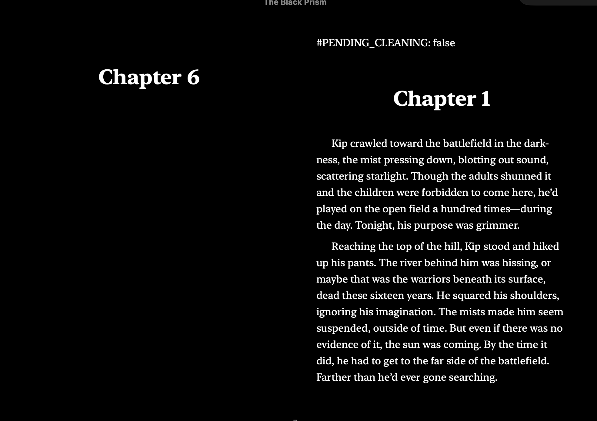

# BookWash - Development TODO

## Current Status
✅ Flutter UI implemented with mock processing
✅ Test EPUB files created (4 storybooks)
✅ Requirements and testing framework documented

## Next Steps
- try paragraph size to be 16 instead of 8
- Check the content order, something out of order.
- I don't think the cover image is getting put back together correctly
- strip out the #PENDING_CLEANING = false flag

- add "accept all language" button
- If we verify the chapters meet rating scale, is it using language MPAA or something else? Also what if we fail the verify? I don't think this is working
- make the accept button in the same spot every time so I can tap it quuickly
- Can we make the reviews go in the right order? Right now chapter 16 is before chapter 5
- I don't have an idea of how many total paragraphs there are to review. I'd like to see an overall percent
- What do I do about ones that slip through the cracks? See screenshot
- make the right side editable again
- Make the UI a bit more fun, with Emojis, fun language, images?
- Make it so it handles if the user starts a book and then comes back
- Update the github readme with more details on what works and doesn't
- Test thoroughly with various EPUB structures
- Add a donation button
- What happens if they leave and come back to the page?
- Post to a few places like Linkedin

## DONE
- Regex prefilter for unambiguous profanity (shit→crud, fucking→freaking, etc.) - new file: scripts/language_prefilter.py
- Try and rename the chapters based on the actual book chapters